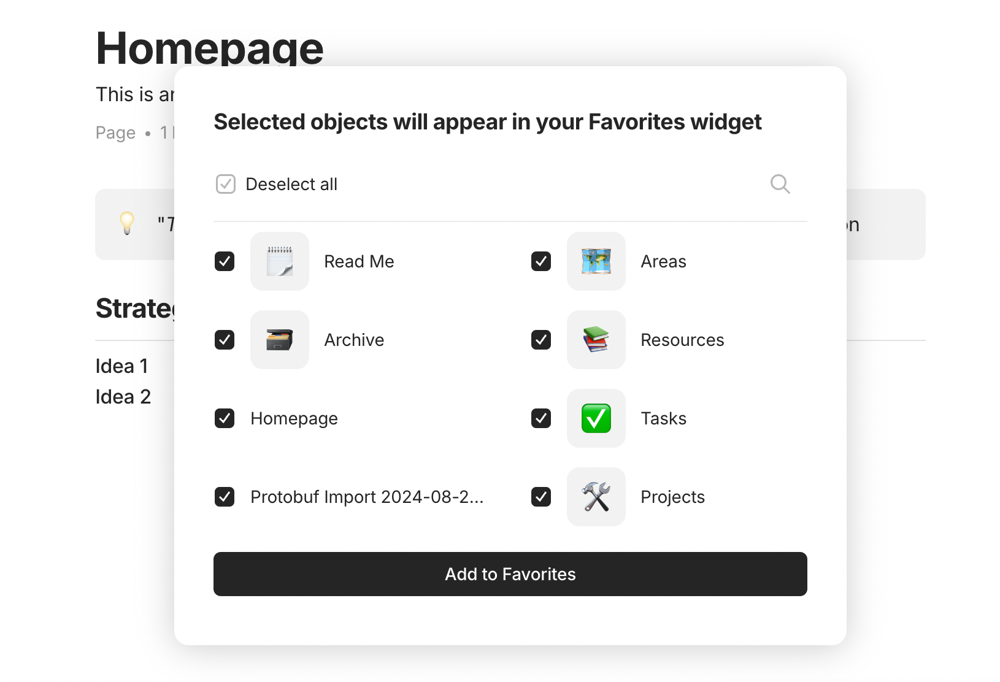

# 导入与导出

您可以通过导航到菜单栏中的 **Anytype > 空间设置 > 导入/导出空间** 来导入或导出您的空间：

<figure><figcaption></figcaption></figure>

或者，您可以在[空间设置](../space/space-settings.md)的集成部分找到导入到/导出空间选项：

<figure><figcaption></figcaption></figure>

您也可以在搜索菜单中简单地输入“导入”或“导出”。

### 导入

我们目前支持导入以下内容：

* **MD (Markdown)**: 您可以导入单个 `.md` 文件或包含多个 Markdown 文件的 zip 文件。请注意，目前关系不会被导出。
* **HTML**
* **TXT**
* **CSV:** 可以通过使用相同的标题将列映射到现有的预安装关系（如电话、电子邮件等）。
* **Any-Block**:
  * **Protobuf**
  * **JSON**

导入完成后，一个新的集合将出现在侧边栏的收藏夹小部件中。所有导入的对象都将在那里。

<figure><figcaption></figcaption></figure>

您还会被询问是否将导入文件中的哪些对象添加到收藏夹：

<figure><figcaption></figcaption></figure>

### 导出

我们目前支持以下格式的导出：

* **Markdown**
* **Any-Block**（包括 Protobuf 和 JSON）
