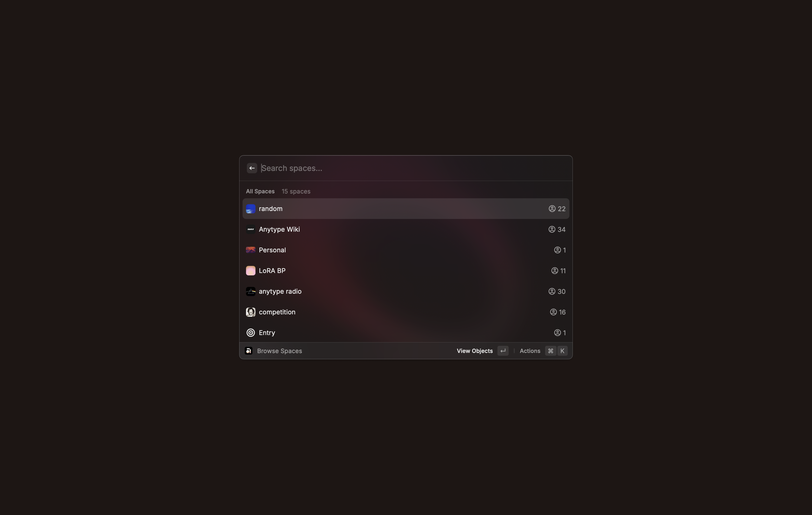

# Raycast 扩展（macOS）

我们期待已久的 API 正在逐步成型！第一步是与 **Raycast** 的集成，您可以通过 macOS 上的 Raycast 创建、读取和删除空间（Spaces）、对象（Objects）和类型（Types），还可以跨它们进行搜索。

虽然这个初始版本专注于一组基础功能，但我们正在为开放 API 奠定基础，未来将支持批量导入和导出、无代码工具（NoCode tools）以及更多集成。我们迫不及待想看看您会用它构建什么！

[在此安装 Raycast 扩展](https://www.raycast.com/any/anytype)

<figure><figcaption></figcaption></figure>

---

### 隐私保护

我们的 API 在您的设备上本地运行，无需互联网连接，并且需要客户端（例如 Raycast 扩展）进行身份验证才能检索和访问数据。

为了实现这一点，Raycast 会通过一个 4 位数弹窗与应用程序配对。这会通知您扩展程序正在请求对您账户的有限访问权限。

API 密钥存储在扩展程序的加密本地存储中，并用于从应用程序中获取数据（例如显示空间、对象等）。

因此，只有经过授权的应用程序才能通过 API 访问您的数据，其他未经授权的应用程序无法访问。